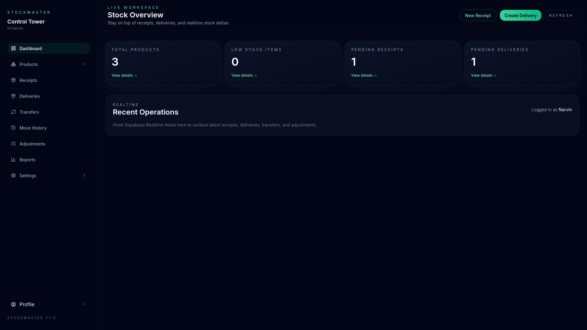

<h1 align="center">StockMaster – Modular Inventory Control for Multi-Warehouse Teams</h1>

<p align="center">Next.js 14 + Supabase workspace that digitizes receipts, deliveries, transfers, adjustments, and stock audits with realtime visibility.</p>

<p align="center">
  <a href="https://stock-master-phi.vercel.app/" target="_blank" rel="noreferrer">
    
  </a>
</p>

<div align="center">
  <table>
    <tr>
      <td align="center">
        <br />Next.js 14
      </td>
      <td align="center">
        <br />React 18
      </td>
      <td align="center">
        <br />TailwindCSS
      </td>
      <td align="center">
        <br />Supabase (Postgres/Auth)
      </td>
      <td align="center">
        <br />Node Tooling
      </td>
      <td align="center">
        <br />Vitest
      </td>
    </tr>
  </table>
</div>

---

## 🚀 Overview

StockMaster replaces spreadsheets with a role-aware control tower for inventory managers and warehouse staff. The workspace provides:

1. **Unified Operations** – Receipts, deliveries, transfers, adjustments, and ledger all share the same deterministic timestamp formatting and validation workflow.
2. **Realtime Decisions** – Supabase Realtime pushes stock deltas into dashboards, product tables, and kanban boards without manual refreshes.
3. **Secure Access** – Supabase Auth with login IDs + OTP reset flows, RLS policies, and UI-level guardrails keep critical actions under `inventory_manager` control.

---

## 🧭 Core Features & Functionality

| Domain | Highlights |
| --- | --- |
| **Authentication** | Login via login ID, OTP-based password reset, signup redirect, session-aware sidebar with logout flyout. |
| **Dashboard** | KPI grid (products, low stock, receipts, deliveries) + deterministic timestamp formatting to avoid hydration mismatches. |
| **Receipts** | Search, list/kanban toggle, supplier contact card, editable draft view with responsible assignee, schedule date, and line-item editor. |
| **Deliveries** | Draft to validation with pick/pack toggles, per-item status, validation button gated to inventory managers. |
| **Transfers** | Internal move log with view toggle, validation, and audit-friendly detail cards. |
| **Adjustments** | Count variance tracking, ledger breakdown, back navigation, and color-coded differences. |
| **Move History (Ledger)** | Search-as-you-type, icon-only view toggle, kanban columns grouped by status, filterable data table. |
| **Settings** | Warehouses, locations, categories, products; CRUD restricted via RLS + UI gating. |
| **Profile** | Update full name, login ID, default warehouse; quickly sign out through sidebar profile flyout. |

---

## 🗂️ Folder Structure (annotated)

```
app/
  auth/                # Login, signup, OTP reset flows (client + server components)
  (workspace)/         # Secure area: dashboards, domains, settings, profile
components/
  common/              # DataTable, StatusBadge, shared widgets
  layout/              # Sidebar, PageHeader, flyouts
  receipts/…           # Receipt list, form, kanban cards
  move-history/…       # Move history kanban columns
lib/
  supabase/            # Server/browser/anon clients, service helpers
  auth.js              # Session utilities + guards
  formatters.js        # Deterministic date/time helpers
supabase/
  schema.sql           # Enums, tables, triggers, RLS, transactional RPCs
scripts/
  seed.js              # Service-role seed script (warehouses, stock, demo users)
tests/
  api/, utils/         # Vitest suites for API handlers & ledger logic
```

---

## ⚙️ Setup & Development

```bash
npm install

# Apply database schema
supabase db reset --file supabase/schema.sql   # or use the Supabase SQL editor

# Seed demo warehouses/locations/products/users
npm run seed

# Start the workspace
npm run dev
```

Visit `http://localhost:3000` to interact with the auth flows and workspace UI.

### Environment Variables

```bash
NEXT_PUBLIC_SUPABASE_URL=your-supabase-url
NEXT_PUBLIC_SUPABASE_ANON_KEY=public-anon-key
NEXT_PUBLIC_SITE_URL=http://localhost:3000
SUPABASE_SERVICE_ROLE_KEY=service-role-key
```

### Testing

```bash
npm run test
```

Vitest (configured via `vitest.config.js`) supports `@` aliases and powers unit + flow tests for APIs and ledger utilities.

---

## 🔐 RBAC, Realtime & Data Integrity

- `StockRealtimeObserver` listens to `stock_levels` + `stock_ledger` channels so dashboards and kanban boards stay fresh without reloads.
- `supabase/schema.sql` defines enums, triggers (`updated_at` automation), and RPC helpers (`validate_receipt`, `create_ledger_entry`).
- RLS policies limit write actions to `inventory_manager`, while React components hide validation buttons or edit paths for other roles.

---

## 📦 Deployment Notes

1. Mirror `.env` variables in your hosting provider (Vercel, Render, etc.) but never expose `SUPABASE_SERVICE_ROLE_KEY` client-side.
2. Run `supabase/schema.sql` when provisioning new environments; follow with `npm run seed` only for local/staging data.
3. Customize Supabase Auth email templates so OTP/reset flows match brand tone.
4. Enable Supabase Realtime (default on hosted projects) so dashboards and kanban columns receive live updates.

---

## 📘 API Docs & Demo

- Postman Published Documentation: https://documenter.getpostman.com/view/39189509/2sBXigMtds
- Demo Video: https://youtu.be/jW3N5y22LoI?si=loHINSVVbZP197BR

---

## 🛣️ Roadmap Ideas

- Expand Vitest coverage across remaining API routes and UI hooks.
- Add barcode/RFID scanning integrations for receipts and deliveries.
- Introduce export/reporting suites for finance & audit teams.
- Layer in optimistic UI + toast notifications for validation workflows.

---

Need enterprise tailoring or custom workflows? Extend Supabase RPCs and Next.js routes following the existing domain modules and UI patterns.